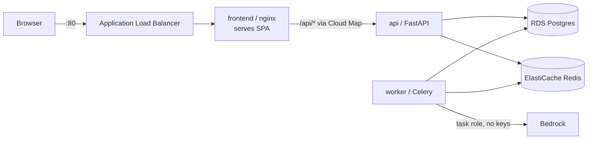

# Deploying to AWS from scratch

How this Docker Compose app got onto AWS Fargate, what the pipeline does, and
the six bugs that only appeared once it was actually deployed.

This is the narrative account. For the bare runbook see
[`terraform/README.md`](../terraform/README.md); for the pre-deployment design
rationale (why Fargate, why keep Celery, why Bedrock) see
[`aws_deployment_guide.md`](aws_deployment_guide.md).

---

## What got built

Five compose services became a Fargate stack in one VPC:

| Compose | AWS |
| --- | --- |
| `postgres:16-alpine` | RDS Postgres 16, `db.t4g.micro`, encrypted, not public |
| `redis:7-alpine` | ElastiCache Redis 7.1, `cache.t4g.micro` |
| `app` (FastAPI) | Fargate service, behind Cloud Map DNS |
| `worker` (Celery) | Fargate service, same image, different command |
| `frontend` (nginx) | Fargate service, the only ALB target |



The ALB forwards **everything** to the frontend. nginx serves the built React
SPA and proxies `/api/*` onward to the API over Cloud Map DNS. That keeps the
app same-origin, so there is no CORS configuration anywhere.

### Deliberate choices

- **Two environments, one config.** Terraform workspaces `dev` and `prod`, with
  every resource named `agent-harness-<workspace>`. State is namespaced under
  `env:/<workspace>/` in one bucket, so a `destroy` can never cross over.
- **Sized identically, because it is a POC.** `prod` is a second isolated stack,
  not a hardened one. Both are built to be destroyed: no deletion protection, no
  RDS final snapshot, `force_delete` on ECR, 0-day secret recovery. The knobs to
  restore for a real production environment are listed at the top of
  `terraform/locals.tf`.
- **Public subnets, no NAT.** Saves ~$32/month. RDS and ElastiCache sit in those
  subnets but are not publicly accessible — the security groups are the real
  gate.
- **No stored AWS credentials.** GitHub authenticates by OIDC; the app reaches
  Bedrock through the ECS task role. There is no access key anywhere in the
  repo, in GitHub, or in the task definitions.

---

## From scratch

### 1. Bootstrap (local, once per account)

The only command you ever run by hand. GitHub cannot authenticate to AWS until
the role it assumes exists, so this cannot be automated away.

```bash
export AWS_PROFILE=mgmt
cd terraform/bootstrap
terraform init
terraform apply -var="aws_profile=mgmt"
terraform output github_deploy_role_arn
```

Creates the state bucket (versioned, encrypted), the DynamoDB lock table, the
GitHub OIDC provider, and the deploy role.

### 2. GitHub (once)

Settings → Secrets and variables → Actions → **Variables** (not Secrets):

| Name | Value |
| --- | --- |
| `AWS_DEPLOY_ROLE_ARN` | the output above |
| `AWS_REGION` | `us-east-1` |

Settings → **Environments**: create `dev` (no rules) and `prod` (add yourself as
a required reviewer).

No GitHub secrets are needed. The role ARN is an identifier, not a credential —
access is decided by the role's trust policy.

### 3. Deploy dev — push

```bash
git push origin aws-deployment
```

### 4. Promote to prod — tag

```bash
git tag prod-2026-08-13
git push origin prod-2026-08-13
```

Same commit, same image digests, `prod` workspace. The deploy job pauses for
approval because it declares `environment: prod`.

### 5. Real secret values (once per environment)

Terraform creates them with `REPLACE_ME` placeholders:

```bash
aws secretsmanager put-secret-value --profile mgmt \
  --secret-id agent-harness-dev/LANGFUSE_SECRET_KEY --secret-string '...'
# also LANGFUSE_PUBLIC_KEY and TAVILY_API_KEY
```

Then push again to roll the tasks onto the real values. Also confirm the SNS
subscription email, or the error alarm will never reach you.

---

## The pipeline

One workflow, [`ci.yml`](../.github/workflows/ci.yml). Checks always; deploy
only on a push, only after every check is green.

| Job | Does | AWS? |
| --- | --- | --- |
| `quality` | pre-commit: ruff, terraform fmt, hygiene, secret scan | no |
| `terraform` | `validate` with `-backend=false` | no |
| `test` | pytest — 31 unit tests | no |
| `smoke` | boots the real compose stack and exercises it | no |
| `target` | resolves ref → environment, or skips | no |
| `ecr` | creates the ECR repos if missing | yes |
| `build` | both images, parallel, GHA layer cache | yes |
| `deploy` | apply, roll ECS, wait stable, smoke the ALB | yes |

```
push to aws-deployment  ->  dev   (automatic)
push tag prod-*         ->  prod  (waits for the reviewer)
anything else           ->  checks only
```

### Why it is one file

Chaining a second workflow (`workflow_run`) and the manual "Run workflow" button
both require the workflow to live on the repo's **default branch**. `master` is
deliberately kept free of AWS code, so neither is available. Plain `push`
triggers work from any branch, and the approval gate is attached to the GitHub
Environment rather than the trigger — so nothing is lost.

### Two guards worth knowing

- **Deploys skip when unconfigured.** If `AWS_DEPLOY_ROLE_ARN` is unset, the
  `target` job resolves to no environment and the pipeline runs checks only,
  staying green instead of failing on missing credentials.
- **An in-flight apply is never cancelled.** The workflow-level
  `cancel-in-progress: true` is right for checks and dangerous for deploys —
  cancelling mid-`terraform apply` strands the DynamoDB lock. The `ecr` and
  `deploy` jobs each carry their own concurrency group with cancellation off.

---

## The six bugs

Every one of these passed local tests and CI. They are the actual content of
"deploying to AWS."

### 1. The OIDC subject claim changes when a job declares an environment

**Symptom:** `ecr` and `build` authenticated fine; `deploy` failed with
`Not authorized to perform sts:AssumeRoleWithWebIdentity`.

**Cause:** the trust policy had been scoped to the two git refs that deploy. But
a job that declares `environment:` gets a *different* subject claim — GitHub
**substitutes** the environment for the ref rather than including both:

| Job | declares `environment:` | `sub` claim |
| --- | --- | --- |
| `ecr`, `build` | no | `repo:owner/repo:ref:refs/heads/aws-deployment` |
| `deploy` | yes | `repo:owner/repo:environment:dev` |

**Fix:** trust all four exact subjects. Still scoped — no wildcard over refs.

### 2. Cloud Map needs Route 53 permissions

**Symptom:** `ACCESS_DENIED: not authorized to perform route53:CreateHostedZone`.

**Cause:** `aws_service_discovery_private_dns_namespace` creates a Route 53
private hosted zone underneath. The deploy role had `servicediscovery:*` but no
`route53:*`, and nothing in the Terraform mentions Route 53.

**Fix:** add `route53:*`. Destroy needs the matching delete permissions too.

**Lesson:** a managed service's IAM surface includes the services it creates on
your behalf.

### 3. Security groups do not allow traffic between their own members

**Symptom:** all three tasks healthy, ALB healthy, Cloud Map DNS correct — and
every `/api/*` request returned **504**.

**Cause:** the ECS security group allowed port 8000 only *from the ALB security
group*. But nginx does not reach the API through the ALB; it resolves
`api.<ns>.local` and connects task-to-task. Under `awsvpc` each task has its own
ENI inside that same group, and a security group does **not** implicitly permit
traffic between its own members.

**Fix:** a self-referencing ingress rule on 8000 (`self = true`).

**Lesson:** compose cannot catch this. Both containers share a bridge network
with no security groups at all, so the identical proxy path works locally. This
class of bug exists only in the AWS topology.

### 4. Two dependency files that must agree, and nothing keeping them in sync

**Symptom:** `ModuleNotFoundError: langchain-aws` — but only on AWS, and only
once a job actually ran.

**Cause:** `langchain-aws` was in `requirements.txt` but not `pyproject.toml`.
The Dockerfile installs from `pyproject.toml`, so the image never had it. Local
venvs came from `requirements.txt`, and `MODEL_PROVIDER` defaults to `ollama`
locally and `bedrock` on AWS.

It survived boot, the health check, and the compose smoke test because the
provider imports in `app/agent/model.py` are **lazy** — inside the branch that
uses them. Lazy imports move failures from startup to request time.

**Fix:** add the package, plus two tests in
[`tests/test_dependencies.py`](../tests/test_dependencies.py):

- every `MODEL_PROVIDER` option's package must be importable
- `requirements.txt` must be a subset of `pyproject.toml`

...and a smoke step that imports all six providers **inside the built image**,
because the unit tests validate the manifest while the smoke test validates the
artifact.

### 5. nginx caches the upstream IP forever

**Symptom:** intermittent **502** after a deploy. Working one minute, broken the
next, fixed by restarting the frontend.

**Cause:** `proxy_pass http://api.<ns>.local:8000/` with a *literal hostname*
resolves once at nginx worker startup and caches that IP for the life of the
process. Replacing the API task gives it a new ENI IP; Cloud Map updates its A
record, and nginx keeps dialling the dead address.

Note the status code distinction: #3 gave **504** (packets dropped, timeout),
this gives **502** (connection refused). The code tells you which layer to look
at.

**Fix:** reach the upstream through a *variable*, which forces re-resolution per
request:

```nginx
resolver ${DNS_RESOLVER} valid=10s ipv6=off;
set $backend "${BACKEND_URL}";
rewrite ^/api/(.*)$ /$1 break;   # variable proxy_pass loses prefix-stripping
proxy_pass $backend;
```

The resolver differs per environment, so it is substituted too: `127.0.0.11`
(Docker's embedded DNS) for compose, `169.254.169.253` (AmazonProvidedDNS) from
the ECS task definition. This one the smoke test *does* cover, since it
exercises `/api/health` through nginx.

### 6. A cancelled apply can strand the state lock

**Symptom:** none yet — caught before it bit.

**Cause:** `cancel-in-progress: true` at workflow level meant a rapid second
push could cancel a run mid-`terraform apply`, leaving the DynamoDB lock held
and blocking every later deploy until someone ran `force-unlock`.

**Fix:** job-level concurrency on the two jobs that run Terraform, with
cancellation off and separate groups so they cannot wait on each other.

### The pattern

Three of these — 1, 3, and 5 — are invisible locally *by construction*. They
live in the OIDC handshake, the VPC network model, and process-lifetime DNS
caching. No amount of local testing reaches them. Two more (4 and 6) were
findable in principle, and now have tests.

---

## Watching it

```bash
make aws-url               # print the URL, check / and /api/health
make aws-status            # task counts + latest ECS events
make aws-logs s=worker     # live tail (s=api|worker|frontend)
make aws-errors            # ERROR lines from all three, last 30m
```

All default to `env=dev profile=mgmt`; override per command
(`make aws-logs s=api env=prod`).

Logs are structured JSON, one object per line, so a single job traces end to end
in CloudWatch Logs Insights:

```sql
fields @timestamp, event, status, step, elapsed_s
| filter job_id = "<job_id>" | sort @timestamp asc
```

When a container dies before logging anything, the reason is in ECS rather than
CloudWatch — `make aws-status` shows the service events where it appears.

---

## Tearing it down

```bash
make aws-destroy        # both stacks; keeps state bucket + deploy role
make aws-nuke           # the above, plus the backend and IAM — literal zero
make aws-verify-clean   # 22 checks; exits non-zero if anything remains
```

`aws-nuke` empties every object *version* from the state bucket before
destroying it — the bucket is versioned and `force_destroy = false`, so
`cd bootstrap && terraform destroy` on its own fails with `BucketNotEmpty`.

`aws-verify-clean` deliberately checks more than this project creates, because
an interrupted destroy strands things Terraform no longer tracks. The three that
catch people:

- **RDS manual snapshots** — outlive the instance, keep charging
- **Unattached Elastic IPs** — $3.60/month for doing nothing
- **Route 53 hosted zones** — $0.50/month, created *implicitly* by Cloud Map,
  so easy to forget it exists

After a nuke, clear the `AWS_DEPLOY_ROLE_ARN` GitHub variable — the role is
gone, and clearing it makes the pipeline skip deploys and stay green instead of
failing on credentials. To come back, re-run bootstrap: the role name and
account are fixed, so the ARN is identical and the variable can be pasted back
unchanged.

Cost while running is roughly **$70–80/month** (ALB ~$17, RDS ~$14, Redis ~$12,
three Fargate tasks ~$35). Destroyed between sessions: **$0**.

---

## Known gaps

Real, deliberate, and worth naming rather than hiding:

- **No HTTPS.** HTTP:80 only — no ACM certificate, no 443 listener, no redirect.
  Everything including user email crosses the internet in plaintext.
- **`prod` is not hardened.** `network.tf`, `alb.tf`, and `security.tf` have no
  workspace conditional, so prod inherits public subnets, public task IPs, no
  NAT, and the HTTP-only ALB. Prod today means *bigger and harder to delete*,
  not *safer to reach*.
- **ElastiCache has no encryption or auth token.** Reachable only from the ECS
  security group, but plaintext on the wire inside the VPC. RDS, by contrast,
  has `storage_encrypted = true`.
- **The deploy role is broad.** `iam:*`, `ec2:*`, and friends on `*`. Fine for a
  disposable POC account; tighten before it is anything else.
- **Bedrock is untested by CI.** Tests prove the package is installed; nothing
  proves the task role can mint a token or that the model id is available in the
  account. Only submitting a real job proves that.

### If this were going further

Let the **ALB** do service discovery instead of reimplementing it in nginx: add
a listener rule sending `/api/*` to the API target group directly. That deletes
Cloud Map, the security-group self-rule, and the DNS-resolver workaround — bugs
#3 and #5 stop existing. The one catch is that an ALB cannot rewrite paths, so
the API would need `root_path="/api"` or a router prefix.
