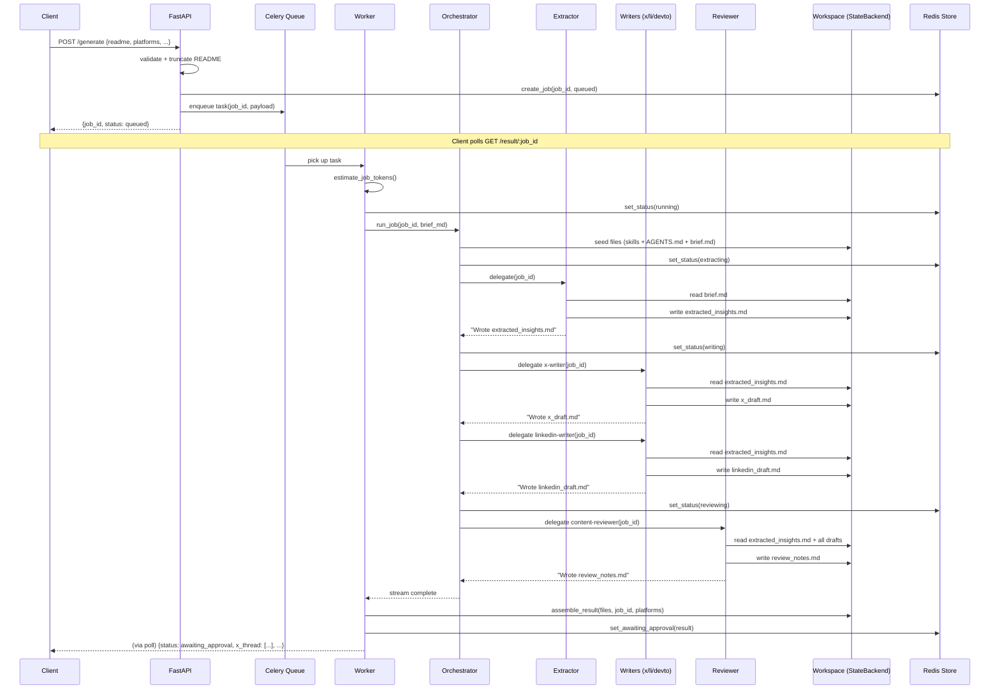
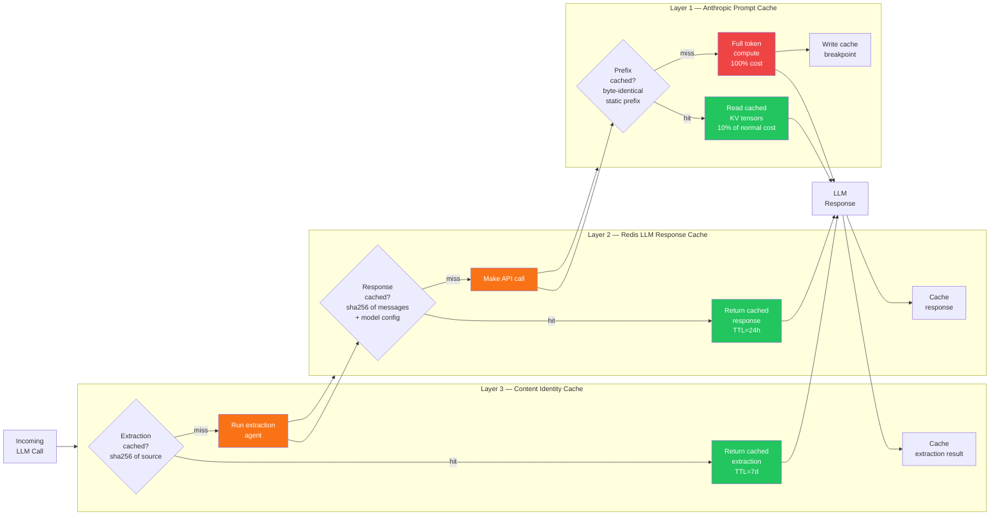
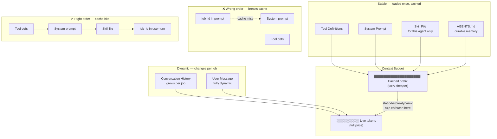
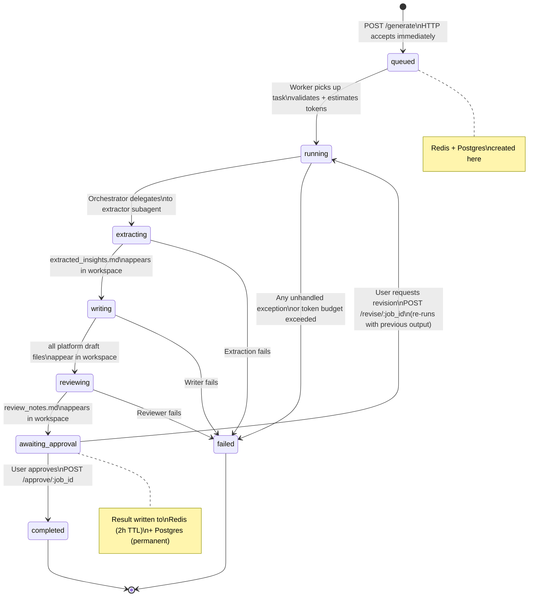
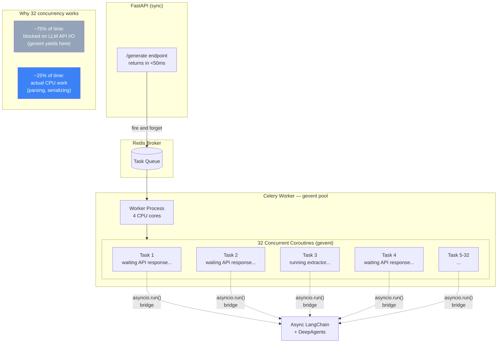
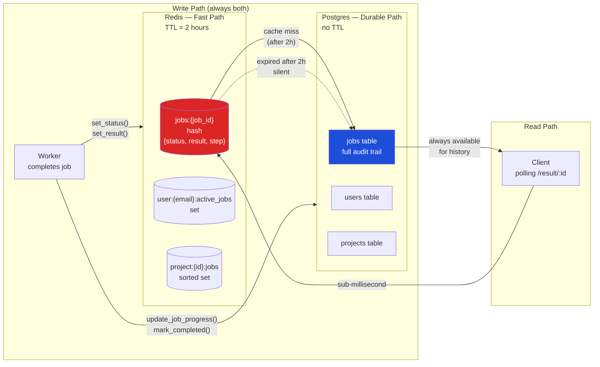

# System Diagrams

---

## 1. Full System Architecture

```mermaid
graph TB
    subgraph Client["Client Layer"]
        C[HTTP Client]
    end

    subgraph API["FastAPI — HTTP Layer"]
        R1[POST /generate]
        R2[GET /result/:job_id]
        RL[Rate Limiter\nper user email]
        VAL[Token Validator\n+ Truncator]
    end

    subgraph Queue["Job Queue — Celery + Redis"]
        B[(Redis\nBroker)]
        W1[Worker — gevent pool\nconcurrency=32]
        W2[Worker — gevent pool\nconcurrency=32]
    end

    subgraph Store["State Stores"]
        RJ[(Redis\nJob Store\nTTL=2h)]
        PG[(Postgres\nDurable Record)]
    end

    subgraph Harness["Agent Harness"]
        ORCH[Orchestrator\nbuilt once via lru_cache]
        subgraph Workspace["StateBackend — Virtual Filesystem"]
            F1[/workspace/job_id/brief.md]
            F2[/workspace/job_id/extracted_insights.md]
            F3[/workspace/job_id/x_draft.md]
            F4[/workspace/job_id/linkedin_draft.md]
            F5[/workspace/job_id/devto_draft.md]
            F6[/workspace/job_id/review_notes.md]
        end
        subgraph Agents["Subagents — Isolated Contexts"]
            A1[extractor]
            A2[x-writer]
            A3[linkedin-writer]
            A4[devto-writer]
            A5[content-reviewer]
        end
        subgraph Skills["Skill Files"]
            SK1[/skills/extractor/SKILL.md]
            SK2[/skills/x-writer/SKILL.md]
            SK3[/skills/linkedin-writer/SKILL.md]
            SK4[/skills/devto-writer/SKILL.md]
            SK5[/skills/content-reviewer/SKILL.md]
        end
        MEM[/context/AGENTS.md\ndurable memory]
    end

    subgraph Cache["Caching Stack"]
        PC[Anthropic\nPrompt Cache\n90% off cached tokens]
        RC[(Redis\nLLM Response Cache\nTTL=24h)]
        EC[(Redis\nExtraction Cache\nTTL=7d)]
    end

    subgraph Obs["Observability"]
        LF[LangFuse\nFull call traces]
        LOG[Structured Logs\njob_id, status, elapsed]
    end

    C -->|POST readme + params| R1
    R1 --> RL
    RL --> VAL
    VAL -->|validate + truncate| B
    VAL -->|create job record| RJ
    VAL -->|create job record| PG
    R1 -->|job_id + queued| C
    C -->|poll| R2
    R2 -->|read status| RJ
    RJ -.->|fallback| PG

    B --> W1
    B --> W2
    W1 --> ORCH
    W2 --> ORCH

    ORCH --> F1
    ORCH -->|delegate| A1
    A1 -->|reads| F1
    A1 -->|writes| F2
    A1 -->|loads| SK1
    ORCH -->|delegate| A2
    A2 -->|reads| F2
    A2 -->|writes| F3
    A2 -->|loads| SK2
    ORCH -->|delegate| A3
    A3 -->|reads| F2
    A3 -->|writes| F4
    A3 -->|loads| SK3
    ORCH -->|delegate| A4
    A4 -->|reads| F2
    A4 -->|writes| F5
    A4 -->|loads| SK4
    ORCH -->|delegate| A5
    A5 -->|reads| F2
    A5 -->|reads| F3
    A5 -->|reads| F4
    A5 -->|reads| F5
    A5 -->|writes| F6
    A5 -->|loads| SK5
    ORCH --> MEM

    A1 <-->|check/write| EC
    W1 <-->|check/write| RC
    A1 & A2 & A3 & A4 & A5 <-->|system msg cache| PC

    W1 -->|progress + result| RJ
    W1 -->|progress + result| PG
    ORCH -->|trace| LF
    W1 -->|logs| LOG
```

---

## 2. Agent Pipeline — Step by Step



---

## 3. Caching Stack — Three Layers



---

## 4. Context Engineering — What Each Agent Sees



---

## 5. Workspace State Machine — Job Lifecycle



---

## 6. Worker Concurrency Model



---

## 7. Dual Store Pattern — Redis + Postgres


