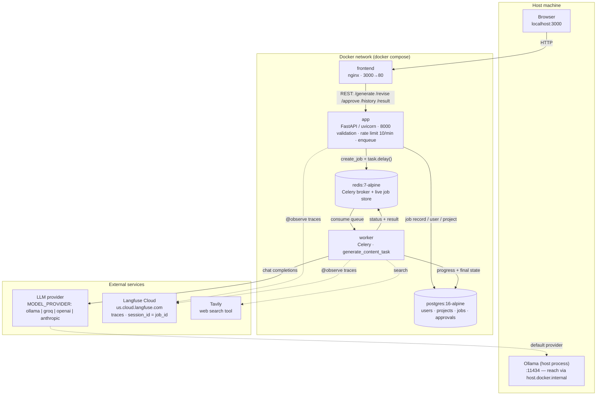
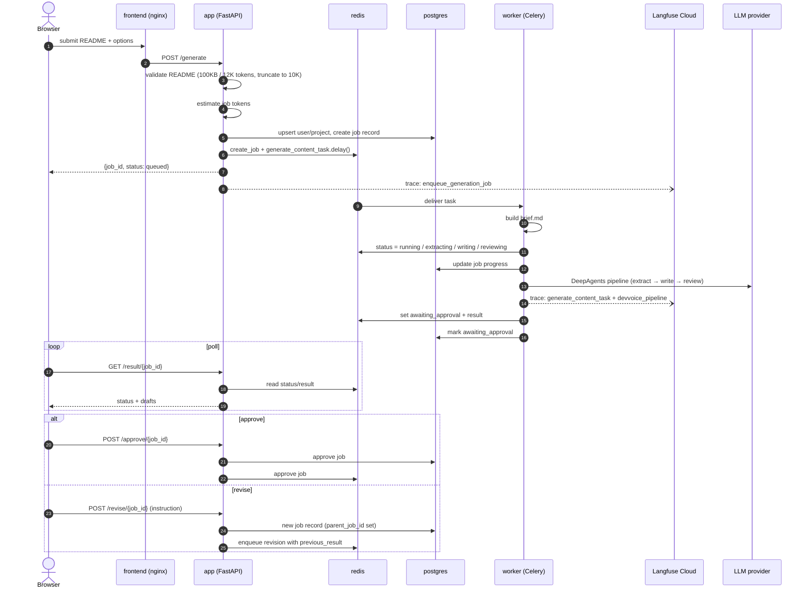
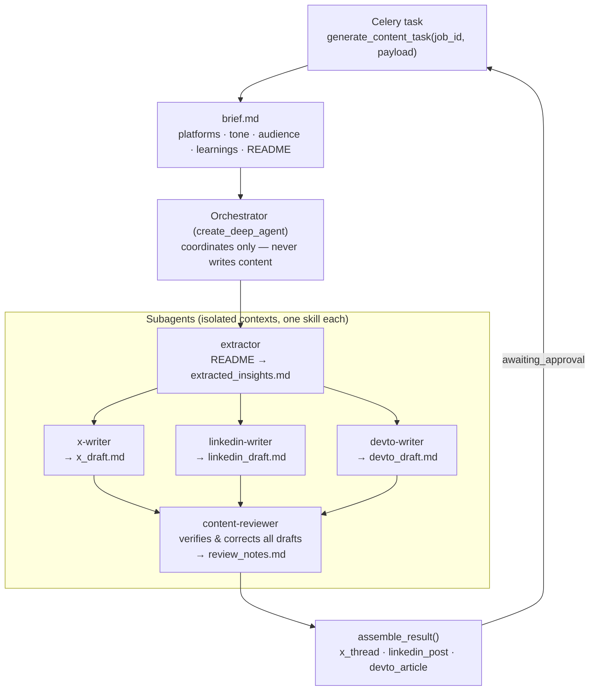

# DevVoice — Full System Diagram

Drop a README, get a reviewed X thread, LinkedIn post, and dev.to article.
Five containers on one Docker network, plus external LLM, observability, and search services.

## Container topology

## Job lifecycle

## Inside the worker — DeepAgents pipeline

## Key environment variables

| Variable | Purpose |
| --- | --- |
| `MODEL_PROVIDER` | `ollama` (default) \| `groq` \| `openai` \| `anthropic` (with prompt caching) |
| `OLLAMA_BASE_URL` | Must be `http://host.docker.internal:11434` from inside containers |
| `REDIS_URL` / `DATABASE_URL` | Overridden by compose to point at the `redis` / `postgres` services |
| `LANGFUSE_SECRET_KEY` / `LANGFUSE_PUBLIC_KEY` / `LANGFUSE_BASE_URL` | Observability — traces from API and worker |
| `TAVILY_API_KEY` | Web search tool for the agent pipeline |

Sources: `docker-compose.yml`, `Dockerfile`, `main.py`, `app/routes/content.py`, `app/worker/tasks.py`, `app/agent/orchestrator.py`, `app/agent/model.py`.
